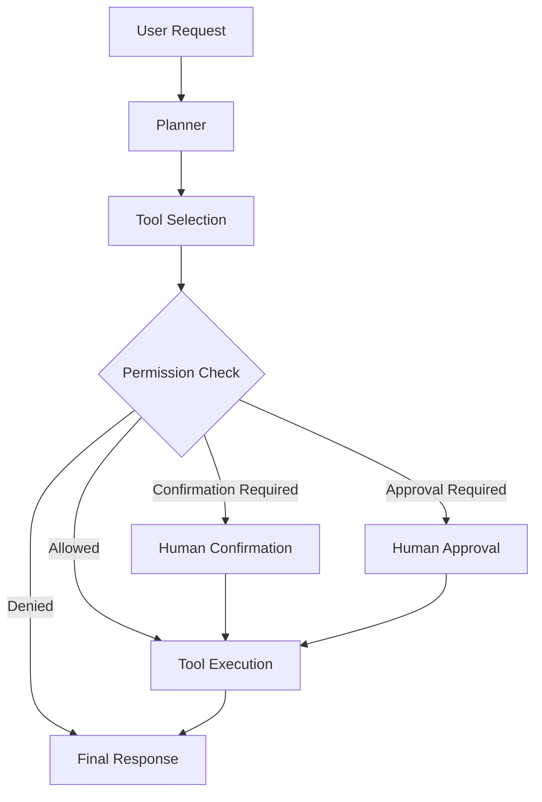

# Permissioned Agent Sandbox

A tool-using AI agent where every tool call goes through permissions, risk checks, validation, rate limits, and human approval.

The main idea is simple:

> The model proposes. The system decides.

## Features

- Role-based tool permissions
- Risk-based tool execution
- Human confirmation and approval
- Approve, reject, modify, and replan actions
- Pydantic validation for tool inputs and outputs
- Per-user tool rate limiting
- Retry and reflection flow
- Live web search
- OpenTelemetry tracing
- Trace timeline
- Safety and usage analytics
- Docker support
- Automated tests

## How It Works



If a tool fails, the agent can retry with feedback from the previous attempt.

If a human requests a replan, the feedback is passed back to the planner before another action is proposed.

## Risk levels
 
| Risk | Behavior |
|---|---|
| Low | Runs immediately |
| Medium | Needs a quick confirmation (approve or reject) |
| High | Needs full approval (approve, reject, modify, or re-plan) |
 
Permission checks are deterministic and separate from the LLM.

## Tools

### `file_reader`

Low-risk tool that reads files only from the sandbox directory.

### `web_search`

Medium-risk tool that searches the live web using Tavily.

Search results are treated as untrusted input, and the model is instructed not to follow instructions contained inside search content.

### `send_email`

High-risk mock tool.

It demonstrates the approval flow without sending a real email.

## Roles

The project uses four roles:

- Viewer
- Analyst
- Operator
- Admin

Each tool defines which roles are allowed to use it.

Roles are selected from the UI for demonstration.

## Observability

Agent runs are traced with OpenTelemetry.

The Trace Timeline shows:

- executed nodes
- selected tools
- permission decisions
- execution time
- trace details

The Safety and Analytics page shows:

- tool usage
- permission denials
- execution errors
- approval activity

## Tech Stack

- Python
- LangGraph
- FastAPI
- Pydantic
- Groq
- Tavily
- OpenTelemetry
- HTML, CSS, JavaScript
- Pytest
- uv
- Docker

## Project Structure

```text
app/
├── agent/
├── api/
├── approval/
├── models/
├── observability/
├── permissions/
├── tools/
└── ui/

sandbox_files/
tests/
```

## Setup

Clone the repository:

```bash
git clone https://github.com/alihassanwarsi/permissioned-agent-sandbox.git
cd permissioned-agent-sandbox
```

Create a `.env` file in the project root:

```env
GROQ_API_KEY=your_groq_api_key
GROQ_MODEL=your_model
TAVILY_API_KEY=your_tavily_api_key
```

## Run with Docker

Make sure Docker is running, then run:

```bash
docker compose up --build
```

Open the frontend:

```text
http://localhost:5500
```

FastAPI documentation:

```text
http://localhost:8000/docs
```

Stop the containers with:

```bash
docker compose down
```

## Run Without Docker

Install dependencies:

```bash
uv sync
```

Start the backend:

```bash
uv run uvicorn app.api.main:app --reload
```

Start the frontend:

```bash
python -m http.server 5500 --directory app/ui
```

Open:

```text
http://localhost:5500
```

## Tests

Run the test suite with:

```bash
uv run pytest
```

Tests cover the main agent flow, permissions, approvals, tools, API, tracing, and analytics.

## Known Limitations

- Workflow state, approvals, traces, and rate limits are stored in memory and reset when the application restarts.
- Roles are selected directly in the UI and are not backed by authentication.
- `send_email` is mocked and does not send real emails.
